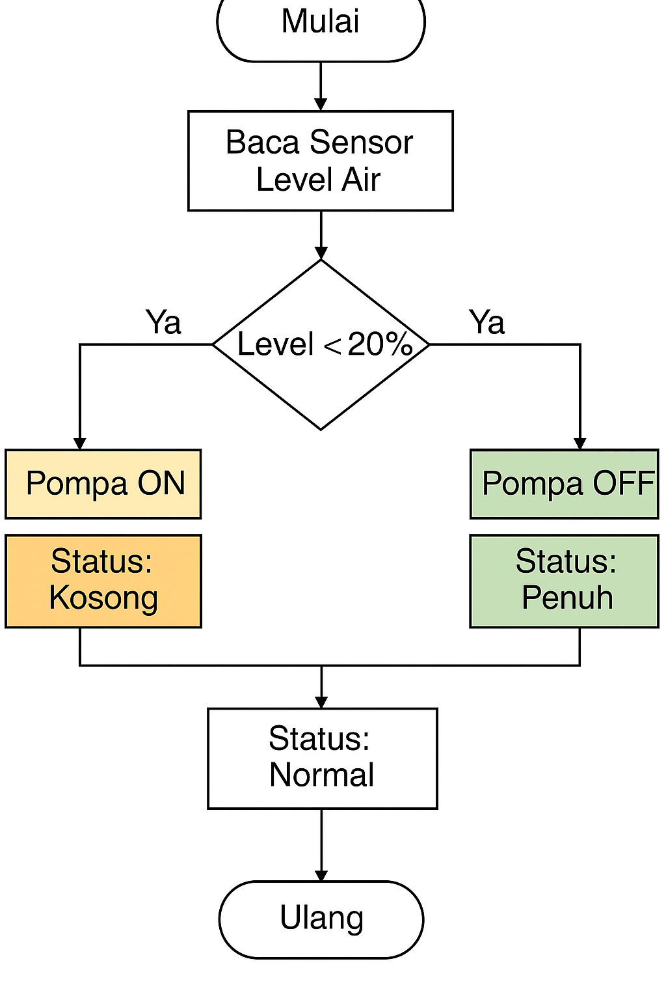

# 💧 SCADA - Monitoring Tangki Air

Simulasi sistem SCADA (Supervisory Control and Data Acquisition) menggunakan Python GUI (Tkinter) untuk memantau level air dalam tangki. Proyek ini dikembangkan sebagai bagian dari pembelajaran sistem kontrol industri, khususnya SCADA pada sektor air, offshore, dan industri manufaktur.

---

## 🎯 Tujuan Proyek

- Memantau level air dalam tangki (0–100%)
- Mengontrol pompa secara otomatis atau manual
- Menampilkan status air: KOSONG, NORMAL, PENUH
- Menyediakan visual HMI sederhana berbasis Python GUI

---

## 🛠️ Tools & Teknologi

| Tools      | Keterangan                      |
|------------|----------------------------------|
| Python 3.10 | Bahasa pemrograman utama         |
| Tkinter     | GUI library untuk HMI             |
| VS Code     | Code editor                     |
| GitHub      | Version control & dokumentasi   |

---

## 🖥️ Tampilan Aplikasi



---

## 🔁 Logika Sistem

```plaintext
Jika Level < 20%  → Pompa ON → Status: KOSONG (Merah)
Jika Level > 80%  → Pompa OFF → Status: PENUH (Oranye)
Jika 20% < Level < 80% → Status: NORMAL (Hijau)
```

---

## 📦 Struktur Proyek

```
/scada-monitoring-tangki-air/
├── scada_tangki.py      ← kode utama GUI
├── README.md            ← dokumentasi proyek
├── flowchart.png        ← diagram sistem
└── dokumentasi.pdf      ← (opsional) versi akademik
```

---

## 🚀 Cara Menjalankan

1. Pastikan Python 3.10 terinstal
2. Jalankan perintah berikut:

```bash
python scada_tangki.py
```

---

## ✍️ Kontributor

> 👨‍💻 **Fadlie Bani Adam**  
> Mahasiswa Teknik Informatika - Institut Teknologi PLN  
> ✉️ LinkedIn :[www.linkedin.com/in/fadlie-bani-adam-845125248]   
> 🔗 GitHub: [github.com/fadlie09](https://github.com/fadlie09)

---

